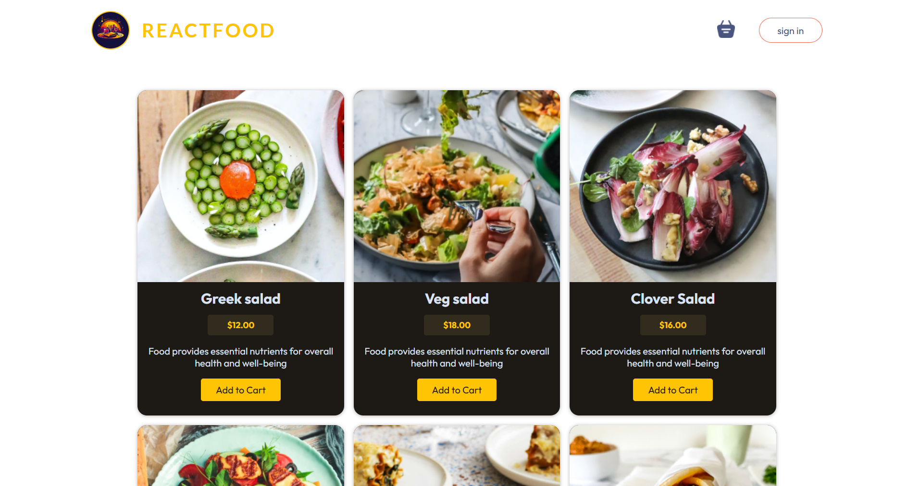
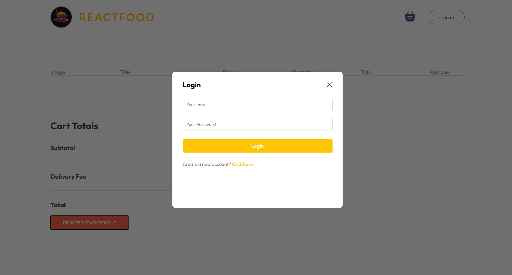
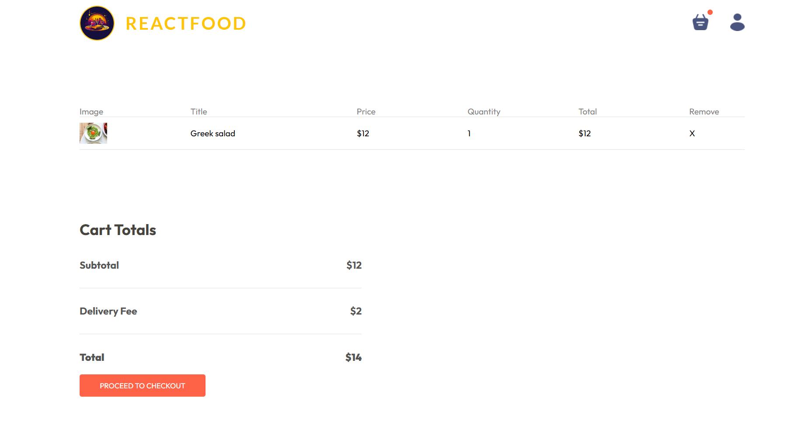
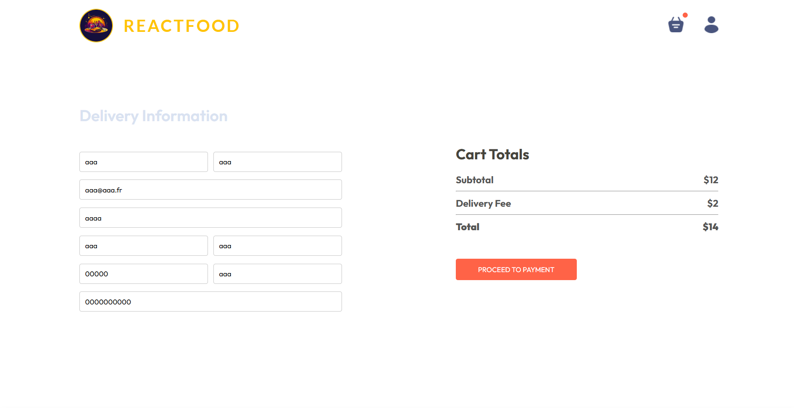
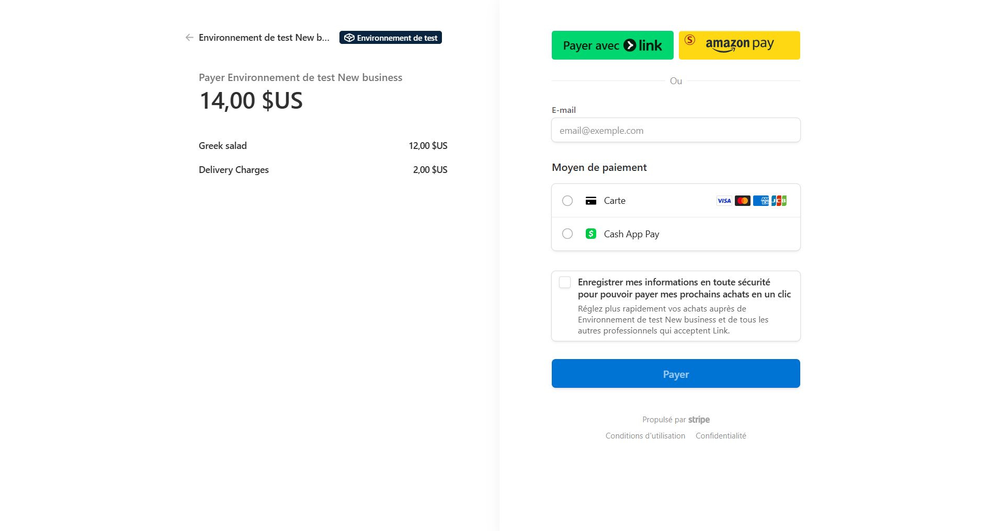

# 🍽️ Food Ordering App

Bienvenue sur **Food Ordering App**, une application web complète basée sur la stack **MERN** (MongoDB, Express, React, Node.js), conçue pour faciliter la commande de repas en ligne. L'application comprend deux interfaces principales :  
- **Interface Utilisateur** : pour la navigation, commande et paiement.  
- **Interface Administrateur** : pour la gestion des produits, utilisateurs et commandes.

---

## 🚀 Fonctionnalités principales

- 🔍 **Interface Utilisateur** : rechercher des plats, ajouter au panier, passer commande.
- 🔐 **Authentification sécurisée** : via JWT.
- 💳 **Paiement sécurisé** : via l’intégration de l’API Stripe.
- 🛠️ **Interface Admin** : gestion des produits, des utilisateurs et des commandes.

---

## 🛠️ Technologies utilisées

| Frontend       | Backend        | Base de Données | Paiement     | Authentification |
|----------------|----------------|------------------|---------------|-------------------|
| React.js       | Node.js        | MongoDB          | Stripe API    | JSON Web Tokens   |
| Redux          | Express.js     |                  |               |                   |
| Axios          |                |                  |               |                   |

---

## 📄 Pages principales de l’application

### 1. 🏠 Page d'Accueil
Affiche la liste des plats disponibles et permet la navigation vers d'autres sections.  


---

### 2. 🛒 Page Panier
Permet à l'utilisateur de visualiser, modifier ou supprimer les articles du panier.  
**Remarque** : une connexion est requise pour passer commande.  


---

### 3. 🔑 Page de Connexion
Accès sécurisé aux informations et commandes personnelles.  


---

### 4. 📦 Page de Commande
Permet de choisir les produits, renseigner l’adresse de livraison et valider la commande.  


---

### 5. 💳 Paiement sécurisé avec Stripe
Intégration complète de **Stripe** pour un paiement rapide et sécurisé.  


---

## ⚙️ Installation

### 📌 Prérequis
- Node.js (version 14 ou supérieure)
- MongoDB installé et en cours d’exécution
- Clé API Stripe (gratuite avec un compte Stripe)

### 🔁 Cloner le dépôt
```bash
git clone https://github.com/votre-utilisateur/food-ordering-app.git
cd food-ordering-app


### Lancer l'application
## 🔧 Backend
cd backend
npm install
npm start
## 🎨 Frontend Utilisateur
cd frontend
npm install
npm run dev
## 🛠️ Interface Admin
cd admin
npm install
npm run dev